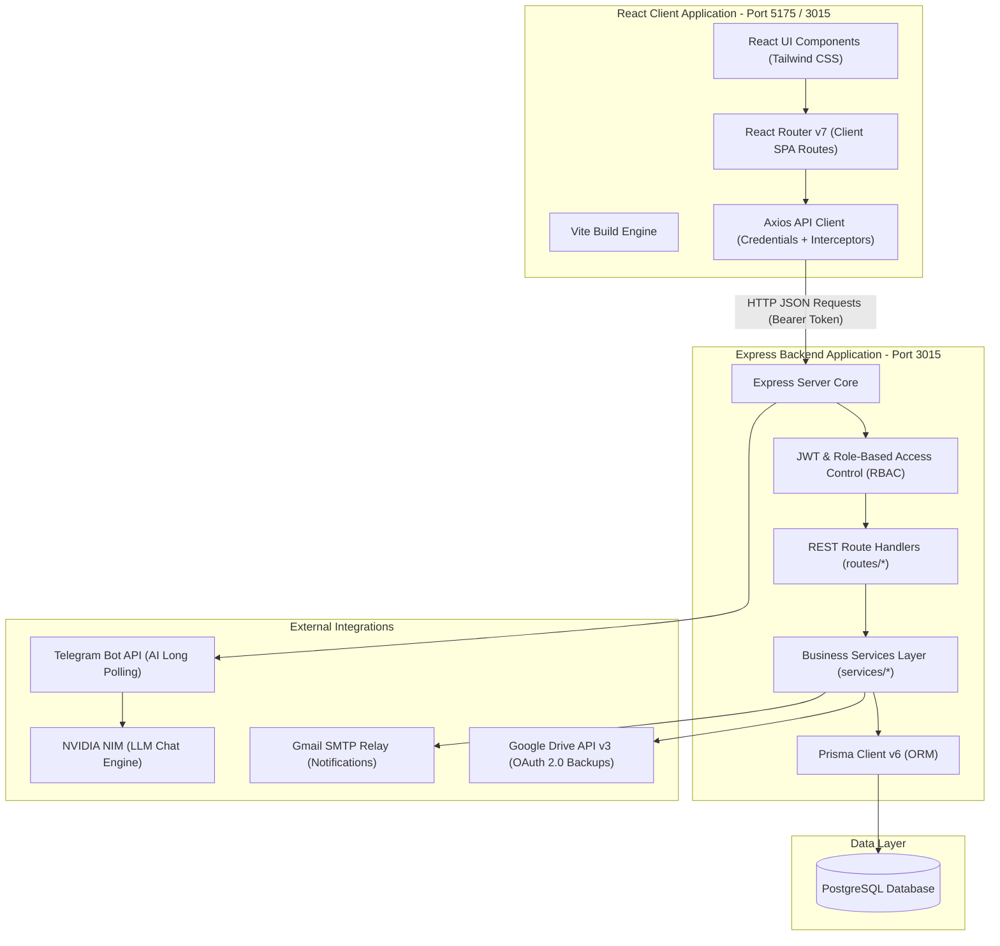

# HiSecure ERP — Complete Architecture & Structure Report

This document provides a comprehensive overview of the systems architecture, codebase design patterns, technology stack, directory layouts, database schema blueprint, and runtime services of the **HiSecure ERP** application.

---

## 1. System Topology & Data Flow

HiSecure ERP runs as a fully decoupled Client-Server architecture:



---

## 2. Directory Layout & Module Structure

The codebase is organized as a unified monorepo workspace containing the frontend client and backend server:

```
erp-app/
├── client/                     # Frontend SPA (Vite + TypeScript)
│   ├── dist/                   # Compiled static HTML/JS/CSS assets served in production
│   ├── src/
│   │   ├── main.tsx            # SPA Client bootstrap entry point
│   │   ├── App.tsx             # Root router, layouts, context providers
│   │   ├── pages/              # Module screens & dashboard panels
│   │   │   ├── Approvals.tsx   # Dashboard to approve/reject PO transactions
│   │   │   ├── ProductDetail.tsx # Detail view showing multi-location stock & transfers
│   │   │   └── Settings.tsx    # Tabbed control panel containing Advanced Audit Log panel
│   │   ├── components/         # Reusable form elements, UI modals
│   │   │   └── AiAssistant.tsx # Interactive AI chat assistant panel (w/ PDF/Excel attachment render support)
│   │   ├── services/           # Axios config (interceptor handles Authorization headers)
│   │   └── types/              # Frontend TypeScript type declarations
│   ├── vite.config.ts          # Vite bundler and dev server proxy settings
│   └── package.json            # Client dependencies (React 19, Tailwind v4, Lucide)
│
├── server/                     # Backend Web API (Node.js + Express + TypeScript)
│   ├── dist/                   # Transpiled server JS files executed in production
│   ├── src/
│   │   ├── index.ts            # Bootstraps Express, connects Prisma, sets up routing
│   │   ├── middleware/         # Security checks (rate-limit, cors, helmet, RBAC)
│   │   ├── routes/             # Controller layer (routes/invoices.ts, routes/pos.ts, routes/ai.ts)
│   │   ├── services/           # Business logic layer (BackupService, AiService, EmailService, SystemHealthService)
│   │   ├── jobs/               # Background schedulers
│   │   │   ├── JobQueue.ts     # Local in-memory task queue fallback (or Redis BullMQ)
│   │   │   ├── JobScheduler.ts # Periodically schedules daily database auto-backups & inventory checks
│   │   │   └── TelegramBotWorker.ts # Handles incoming commands and AI text chats via Telegram Bot API
│   │   └── prisma/
│   │       ├── schema.prisma   # Prisma schema defining the database entities
│   │       └── migrations/     # PostgreSQL schema migration histories
│   ├── package.json            # Server dependencies (Express, Prisma, helmet, jwt, nodemailer)
│   └── tsconfig.json           # Server TypeScript build compiler options
│
├── start-production.bat        # Windows Batch startup script (serves on port 3015)
└── architecture_report.md      # This file
```

---

## 3. Database Schema Blueprint

HiSecure ERP houses 17 relational database tables mapped through Prisma to PostgreSQL. Here is the full entity structure:

### 3.1 Core Identity & Organization
* **`users`**: ERP operator login credentials and main roles.
  - `user_id` (PK), `username` (Unique), `email` (Unique), `password_hash`, `full_name`, `role`, `phone`, `is_active`, `last_login`, `created_at`, `updated_at`
* **`brands`**: Brands/manufacturers associated with inventory parts and repairs.
  - `brand_id` (PK), `name` (Unique), `created_at`
* **`suppliers`**: Procurement vendor profile.
  - `supplier_id` (PK), `supplier_code` (Unique), `name`, `contact_person`, `phone`, `email`, `gstin`, `pan`, `address`, `city`, `state`, `pincode`, `is_active`
* **`customers`**: Customer accounting/contact details.
  - `customer_id` (PK), `customer_code` (Unique), `name`, `phone` (Unique), `contact_person`, `email`, `address`, `city`, `state`, `pincode`, `gstin`, `customer_type` ("retail" / "corporate"), `credit_limit`
* **`locations`**: Physical branches, warehouses, or service centers.
  - `location_id` (PK), `location_code` (Unique), `name`, `address`, `phone`, `email`, `gstin`, `is_main`, `is_active`
* **`technicians`**: Technical staff assigned to repair tickets.
  - `technician_id` (PK), `name`, `phone`, `specialization`, `is_active`

### 3.2 Inventory & Stock Management
* **`parts`**: Products master catalog containing tax codes, pricing, and references.
  - `part_id` (PK), `part_number` (Unique), `name`, `description`, `brand_id` (FK), `hsn_code`, `cost_price`, `selling_price`, `tax_rate`, `reorder_level`, `is_active`
* **`part_stocks`**: Multi-location inventory quantities mapping stock levels to warehouses.
  - `part_id` (PK/FK), `location_id` (PK/FK), `quantity` (Current count)
* **`stock_movements`**: Transaction audit trail tracking all stock increments/decrements.
  - `id` (PK), `part_id` (FK), `location_id` (FK), `movement_type` (`IN`, `OUT`, `TRANSFER_IN`, `TRANSFER_OUT`), `quantity`, `reference_type` (`Invoice`, `PurchaseOrder`, `Repair`, `Transfer`), `reference_id`, `created_at`

### 3.3 Sales & Billing (Sales Invoices)
* **`sales_invoices`**: Tax invoice headers including CGST/SGST/IGST calculations and place of supply.
  - `invoice_id` (PK), `invoice_number` (Unique), `customer_id` (FK), `invoice_date`, `due_date`, `place_of_supply`, `total_amount`, `tax_amount`, `grand_total`, `tax_type`, `cgst_amount`, `sgst_amount`, `igst_amount`, `status` (`draft`, `issued`, `paid`, `cancelled`), `notes`, `created_by` (FK)
* **`sales_invoice_items`**: Line items inside a sales invoice.
  - `item_id` (PK), `invoice_id` (FK), `part_id` (FK), `quantity`, `unit_price`, `tax_rate`, `tax_amount`, `total_amount`, `batch_number`, `serial_numbers` (Array)

### 3.4 Quotations
* **`Quotation`**: Sales quotations sent to clients.
  - `quote_id` (PK), `quote_number` (Unique), `customer_id` (FK), `quote_date`, `valid_until`, `status` (`draft`, `sent`, `accepted`, `declined`, `expired`), `subtotal`, `total_discount`, `total_tax`, `total_amount`, `terms`, `notes`, `created_by` (FK), `converted_to_invoice_id`
* **`QuotationItems`**: Line items inside a sales quotation.
  - `quote_item_id` (PK), `quote_id` (FK), `part_id` (FK), `quantity`, `unit_price`, `discount_percent`, `tax_rate`, `total`

### 3.5 Repairs Module
* **`repairs`**: Job cards tracking diagnostic stages, technicians, and repair costs.
  - `repair_id` (PK), `ticket_number` (Unique), `customer_id` (FK), `brand_id` (FK), `product_type`, `serial_number`, `model_number`, `problem_description`, `repair_status` (`received`, `diagnosed`, `awaiting_parts`, `in_repair`, `ready_for_pickup`, `completed`, `cancelled`), `estimated_cost`, `actual_cost`, `assigned_technician_id` (FK), `received_date`, `diagnosed_date`, `repair_start_date`, `completion_date`, `pickup_date`, `warranty_status`, `warranty_expiry`, `notes`
* **`repair_parts`**: Inventory items consumed during a product repair.
  - `repair_part_id` (PK), `repair_id` (FK), `part_id` (FK), `quantity`, `price_charged`, `notes`
* **`payments`**: Records of payments collected against repair jobs.
  - `payment_id` (PK), `repair_id` (FK), `amount`, `payment_method`, `payment_date`, `status`, `notes`

### 3.6 Procurement & Approval Workflows
* **`purchase_orders`**: Procurement records mapping inventory purchase requirements to suppliers.
  - `po_id` (PK), `po_number` (Unique), `supplier_id` (FK), `order_date`, `expected_delivery`, `total_amount`, `status` (`draft`, `pending_approval`, `approved`, `received`, `cancelled`), `notes`, `created_by` (FK)
* **`purchase_order_items`**: Line items containing unit pricing and quantity.
  - `po_item_id` (PK), `po_id` (FK), `part_id` (FK), `quantity`, `unit_price`, `total_amount`, `batch_number`, `expiration_date`
* **`approval_workflows`**: Configuration of workflows per entity type (e.g. `PurchaseOrder`) with threshold constraints.
  - `workflow_id` (PK), `entity_type` (Unique), `threshold` (Amount exceeding this triggers approval), `created_at`, `updated_at`
* **`approval_steps`**: Steps defining which security role must approve a specific step in the sequence.
  - `step_id` (PK), `workflow_id` (FK), `role_id` (FK), `step_number` (Sequence index)
* **`approval_histories`**: Logs documenting every approval step transition (decisions and review comments).
  - `history_id` (PK), `record_id` (Target PO ID), `step_id` (FK), `user_id` (FK), `status` (`approved`, `rejected`), `notes`, `created_at`

### 3.7 Financial Double-Entry Accounting
* **`accounts`**: Chart of Accounts mapping ledger codes.
  - `account_id` (PK), `account_code` (Unique), `account_name`, `account_type` (`asset`, `liability`, `equity`, `revenue`, `expense`), `is_active`
* **`journal_entries`**: Double-entry accounting transaction header.
  - `entry_id` (PK), `entry_date`, `description`, `reference_type` (`Invoice`, `PurchaseOrder`, `POS`, `Payment`), `reference_id`
* **`journal_entry_lines`**: Individual debit or credit ledger lines.
  - `line_id` (PK), `entry_id` (FK), `account_id` (FK), `amount` (Decimal), `entry_type` (`debit`, `credit`)

### 3.8 Audits & Settings
* **`audit_logs`**: Tracks JSON changes (state differences) for parts, invoices, POs, and transfers.
  - `log_id` (PK), `user_id` (FK), `username`, `action` (`CREATE`, `UPDATE`, `DELETE`, `TRANSFER`), `entity_type` ("Parts", "Invoice", etc.), `entity_id`, `old_value` (JSONB state before), `new_value` (JSONB state after), `details` (computed state diffs), `ip_address`, `created_at`
* **`settings`**: Dynamic key-value configuration block using JSONB value storage.
  - `setting_id` (PK), `key` (Unique), `value` (JSONB configuration settings), `updated_at`

---

## 4. Key Runtime Integrations

### 4.1 Google Drive OAuth 2.0 Backups
To support modern security guidelines, the application supports **OAuth 2.0 User Impersonation** for Google Drive uploads:
* **Configured under settings key**: `'gdrive'`
* **Properties**: `gdrive_enabled`, `use_oauth`, `client_id`, `client_secret`, `refresh_token`, `folder_id`
* **Workflow**: When backups are generated, the system automatically uses the `refresh_token` to retrieve a temporary `access_token` and uploads either `.sql` files (via `pg_dump` utility) or `.json` fallbacks directly to the shared folder.

### 4.2 Gmail SMTP Notifications
* **Configured under settings key**: `'email'`
* **Properties**: `host` (`smtp.gmail.com`), `port` (`587`), `secure` (`false` due to TLS upgrade), `user` (sender email), `pass` (secure Google App Password), `from_name` (`Hi-Secure ERP`)
* **Uptime monitoring**: The system health engine runs a secure connection handshake test periodically with an relaxed 5-second timeout to check mail server reachability.

### 4.3 AI Chat Assistant (NVIDIA NIM)
* **LLM Engine**: Stepfun step-3.7-flash powered by NVIDIA NIM API endpoints.
* **Capabilities**: Can dynamically run diagnostic queries, parse catalog lists, check hardware statuses, and generate formatted PDF/Excel files (including the newly added **Quotations** report type) on-the-fly, returning clean graphical download cards to the user.
