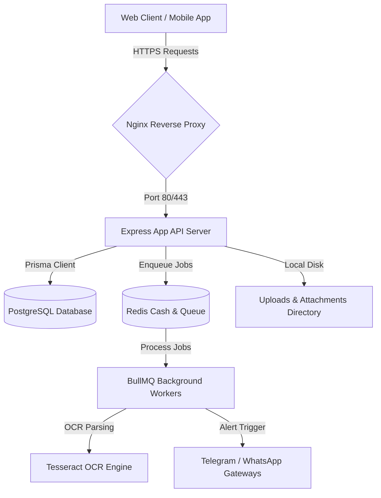

# HiSecure ERP — System Architecture

HiSecure ERP v2.0.0 is engineered with a decoupled client-server topology designed to support secure business flows, real-time worker synchronization, robust database constraints, and high availability.

---

## 1. High-Level Architecture

The system consists of three main components:
1.  **Frontend Client**: A lightweight, responsive Single Page Application (SPA) built using React, TypeScript, and Vite, optimized for fast rendering and offline-first state monitoring.
2.  **Backend Server**: A TypeScript Express server exposing a RESTful API, secured by middleware policies (rate limiting, CORS, Helmet) and backed by Prisma ORM.
3.  **Background Worker & Message Queue**: A Redis-backed BullMQ processing cluster handling CPU-intensive OCR catalog imports, Telegram/WhatsApp alerts, and email notifications without blocking primary HTTP request cycles.

---

## 2. Frontend Technology Stack

| Technology | Version | Purpose |
| :--- | :--- | :--- |
| **React** | 19.x | Component lifecycle rendering and virtual DOM management. |
| **Vite** | 8.x | High-speed hot module replacement and production bundling. |
| **TypeScript** | 6.x | Type safety and documentation constraints across views. |
| **TailwindCSS** | 4.x | Utility-first styling framework supporting dark/light UI modes. |
| **React Router** | 7.x | Client-side page navigation and state loading. |
| **Axios** | 1.x | Promise-based HTTP client for API transactions. |
| **Chart.js** | 4.x | Dashboard data visualization engine. |
| **Socket.io-Client**| 4.x | Real-time health check updates and message broadcasts. |

---

## 3. Backend Technology Stack

*   **Runtime Environment**: Node.js v20 LTS.
*   **Web Framework**: Express.js (v4.21) utilizing TypeScript (`ts-node`/`tsc`).
*   **Database ORM**: Prisma ORM (v6.0) for schema definitions, validation, and auto-generated migrations.
*   **Security & Middleware**:
    *   `helmet`: Enforces secure HTTP headers (XSS protection, Frameguard).
    *   `express-rate-limit`: Prevents brute-force requests on API endpoints.
    *   `cookie-parser`: Secure httpOnly token storage.
    *   `bcrypt`: Blowfish-based password hashing (10 rounds).
    *   `jsonwebtoken`: Access/refresh token generation using HMAC SHA-256 signatures and JTI blacklist verification.
*   **File Processing**:
    *   `multer`: Multi-part form-data handler for uploads.
    *   `sharp`: High-performance image resizing and WebP conversion.
    *   `xlsx` & `pdfkit`: Structured invoice and financial ledger reporting.

---

## 4. Database Architecture

The data layer uses **PostgreSQL 15+** managed via Prisma ORM. It implements a strict schema layout spanning several core modules:

*   **Identity & Access Control**: `users`, `roles`, `permissions`, `user_roles`, `role_permissions`, `token_blacklist`.
*   **Customer & CRM**: `customers`, `crm_contacts`, `leads`, `opportunities`, `amc_contracts`.
*   **Inventory & Warehouse**: `parts`, `brands`, `locations`, `part_stocks`, `warehouse_locations`, `bin_stocks`, `stock_movements`, `stock_transfers`, `cycle_counts`.
*   **Sales & POS**: `sales_invoices`, `sales_invoice_items`, `sales_returns`, `pos_sessions`, `pos_transactions`, `quotations`.
*   **Procurement**: `suppliers`, `purchase_requisitions`, `purchase_orders`, `goods_receipt_notes`, `part_cost_histories`.
*   **Service & AMC Management**: `repairs`, `repair_parts`, `technicians`, `technician_assignments`, `service_jobs`, `service_visits`, `service_resolutions`.
*   **Compliance & Audit**: `audit_logs`, `integrity_audit_runs`, `system_health_logs`, `restore_verification_reports`.

### Ledger Immutability Rule
Financial records (e.g., `accounting_entries`, `journal_entries`, and completed `sales_invoices`) run database-level rules where `UPDATE` or `DELETE` requests are blocked. Adjustments must be posted as correction journal lines.

---

## 5. API Structure

The API follows REST conventions under the `/api` prefix. The server routes requests through sequential validation and authorization layers:

1.  **Transport**: Request lands on Express router.
2.  **Rate Limiting**: IP limit checked.
3.  **Authentication**: Verification of JWT in Authorization header or httpOnly cookie. Checks JTI against Redis blacklist.
4.  **Authorization (RBAC)**: Validates required permissions against user's cached roles.
5.  **Payload Validation**: `express-validator` checks query/body constraints.
6.  **Business Logic & Transaction**: Executed inside `src/routes` using Prisma clients.
7.  **Audit Logging**: Security-relevant updates are written to `audit_logs`.

---

## 6. Hosting Architecture

HiSecure ERP supports cloud and on-premise hosting structures:

*   **Oracle Cloud Infrastructure (OCI) Always Free VM**:
    *   Standard VM.Standard.A1.Flex shape running Oracle Linux 9 / Ubuntu.
    *   2 OCPUs, 12 GB RAM, 50 GB NVMe Storage.
    *   Docker and Docker-Compose orchestration.
*   **Reverse Proxy Layer**: Nginx configured as a reverse proxy managing SSL termination via Let's Encrypt.
*   **Frontend Deployment**: Hosted on Vercel or served statically through Nginx.
*   **Storage**: Shared directory mount (`uploads/`) for document attachments, with automated backup tasks pushed to external secure nodes.
