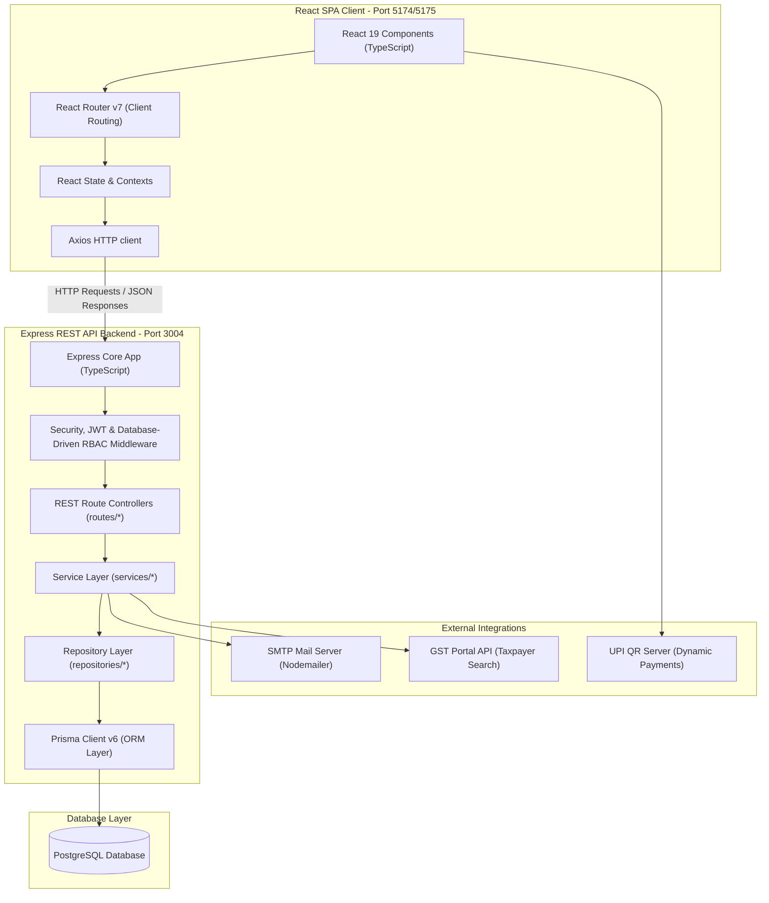

# HiSecure ERP — System Architecture Specification

This document provides a comprehensive overview of the design patterns, technology stack, database layer, and integration points that compose the HiSecure ERP application.

---

## 1. System Overview & Component Diagram

HiSecure ERP is structured as a decoupled **Single Page Application (SPA)** client communicating with a **RESTful API Backend** powered by Node.js, Express, and PostgreSQL, following a clean Service-Repository architecture.



---

## 2. Component Directory Structure

The repository is divided into two primary workspaces: `client` and `server`.

```
erp-app/
├── client/                     # React Frontend Workspace
│   ├── src/
│   │   ├── main.tsx            # React SPA entry point
│   │   ├── App.tsx             # Core router and layout wrappers
│   │   ├── pages/              # Module pages (Dashboard, Invoices, POS, Settings, etc.)
│   │   ├── components/         # Reusable UI elements (SInput, FieldRow, PageBanner, etc.)
│   │   ├── services/           # Api service configuration (axios interceptors)
│   │   └── types/              # TypeScript typings
│   ├── index.html              # HTML shell
│   ├── package.json            # Client dependencies and build scripts
│   └── vite.config.ts          # Vite build config
│
├── server/                     # Express Backend Workspace
│   ├── src/
│   │   ├── index.ts            # Server entry point, express app setup & DB connection
│   │   ├── routes/             # REST Route Controllers (delegates to Services)
│   │   ├── middleware/         # Auth verify checks, JWT, and database RBAC middleware
│   │   ├── services/           # Business logic layer (AccountingService, InvoiceService, etc.)
│   │   └── repositories/       # Data Access layer wrapping Prisma (AccountingRepository, etc.)
│   ├── prisma/
│   │   ├── schema.prisma       # Database design models
│   │   ├── migrate_rbac.sql    # Raw SQL script for RBAC migrations & seeding
│   │   └── migrations/         # SQL schema version histories
│   ├── package.json            # Server dependencies
│   └── tsconfig.json           # TypeScript configuration
```

---

## 3. Technology Stack Matrix

### Frontend (Client SPA)
- **Framework**: React 19 (TypeScript)
- **Tooling/Bundler**: Vite 8 & Esbuild
- **Routing**: React Router DOM v7 (Client-side routing)
- **State/Communication**: React Hooks (useState, useEffect) & Axios (authenticated API client)
- **Styling**: Tailwind CSS v4 & Radix UI primitives (for modal dialogs, menus, avatars)
- **Icons**: Tabler Icons React & Lucide React
- **Data Visualization**: Chart.js & React-ChartJS-2 (dashboard trends & analytics)

### Backend (Server API)
- **Core Platform**: Node.js & TypeScript
- **Web Server**: Express v4 (exposing REST endpoints under `/api/*`)
- **Database Driver/ORM**: Prisma ORM v6
- **Architecture Pattern**: Routes -> Services -> Repositories -> ORM -> Database
- **Authentication**: JSON Web Tokens (`jsonwebtoken`) & Session Cookie management (`cookie-parser`)
- **Security**:
  - `helmet`: Security headers
  - `cors`: Cross-Origin resource restriction
  - `bcrypt`: Argon/bcrypt password hashing
  - `express-rate-limit`: Basic DDoS/spam protection
  - `express-validator`: Payload validation checks
  - **Granular RBAC**: Database-driven permission middleware

### Database (Data Layer)
- **Engine**: PostgreSQL
- **Schema Management**: Managed via Prisma migrations and PostgreSQL script executions

---

## 4. Key Architectural Patterns

### Service-Repository Architecture
To improve testability and separate concerns:
1. **Routes (Controllers)**: Parse HTTP requests, validate basic parameters, and invoke the Service Layer.
2. **Services (Business Logic)**: Coordinate complex operations (such as validating stock availability and posting journal entries). Services accept optional transaction contexts (`tx`) to allow execution nesting.
3. **Repositories (Data Access)**: Package database calls (queries and updates) using the Prisma client.

#### Core Modules
- **Accounting**: `AccountingService` + `AccountingRepository`
- **Inventory/Parts**: `InventoryService` + `PartsRepository`
- **Sales Invoices**: `InvoiceService` + `InvoiceRepository`
- **Procurement/Purchases**: `PurchaseService` + `PurchaseRepository`
- **Repairs Job Ticket**: `RepairService` + `RepairRepository`
- **POS Store counter**: `PosService`
- **Customers**: `CustomerService` + `CustomerRepository`
- **Suppliers**: `SupplierService` + `SupplierRepository`

### Transaction Consistency (Double-Entry & Inventory)
All state-altering actions run inside a database transaction (`prisma.$transaction`).
- **POS Checkout & Sales Invoices**: Atomically deduct inventory stock, create `StockMovement` logs, create the invoice, and post balanced `JournalEntry` records (Debit Cash `101000`/Receivables `104000`, Credit Sales Revenue `401000`).
- **Purchase Order Receiving**: Transitioning POs to `received` status atomically increments inventory, writes `StockMovement` logs, and posts balanced entries (Debit Inventory `103000`, Credit Accounts Payable `201000`).
- **Repairs completion**: Transitioning repairs to `completed` atomically decrements stock for assigned repair parts, logs `StockMovement`, and creates journal entries (Debit Cash `101000`, Credit Sales Revenue `401000` for `actual_cost`).
- **Self-Correcting Rollback capabilities**: Modifying or deleting sales invoices, purchase orders, or repairs automatically reverts the inventory levels and voids the associated double-entry ledger entries.

### Database-Driven Role-Based Access Control (RBAC)
Replaces hardcoded role checks with dynamic, database-driven permissions.
- **Roles**: `admin`, `sales`, `technician`, `accountant`, `inventory_manager`
- **Permissions**: E.g. `invoice:create`, `invoice:edit`, `pos:checkout`, `purchase:receive`, `repairs:update_status`, `ledger:view`
- **Middleware**: `requirePermission(permission: string)` intercepts requests, checks the user's role mapping in the database (`user_roles` and `role_permissions`), and blocks unauthorized actions.

---

## 5. Database Schema Partitioning
The database contains **16 core areas** modeled using Prisma relations:
1. **Core Identity**: `User`, `Brand`, `Supplier`, `Customer`, `Location`, `Technician`
2. **Products & Inventory**: `Parts` (cost, selling price, HSN, brand associations, stocks)
3. **Repairs Workspace**: `Repair`, `RepairParts`, `Payment` (assigned technicians, diagnostic statuses, pick-up dates)
4. **Transactions**: `SalesInvoice`, `SalesInvoiceItems` (GST breakdown: CGST/SGST/IGST, place of supply validation)
5. **Procurement**: `PurchaseOrder`, `PurchaseOrderItems`
6. **Agreements**: `Quotation`, `QuotationItems`, `DeliveryChallan`, `DeliveryChallanItems`, `DeliveryChallanReturns`
7. **CRM**: `CrmContact`
8. **Financial Ledger & Vouchers**: Double-entry system mapping `Account` (Chart of Accounts), `JournalEntry` (headers), and `JournalEntryLine` (debits/credits). Also houses `BankTransaction` and `PayrollEntry` tables.
9. **Configuration**: `Setting` (storing system preferences like dynamic printing defaults in standard JSONB format)
10. **System Audits**: `AuditLog`
11. **Stock Tracking**: `StockMovement` (transactional inventory tracking ledger)
12. **RBAC Layer**: `Role`, `Permission`, `RolePermission`, `UserRole`